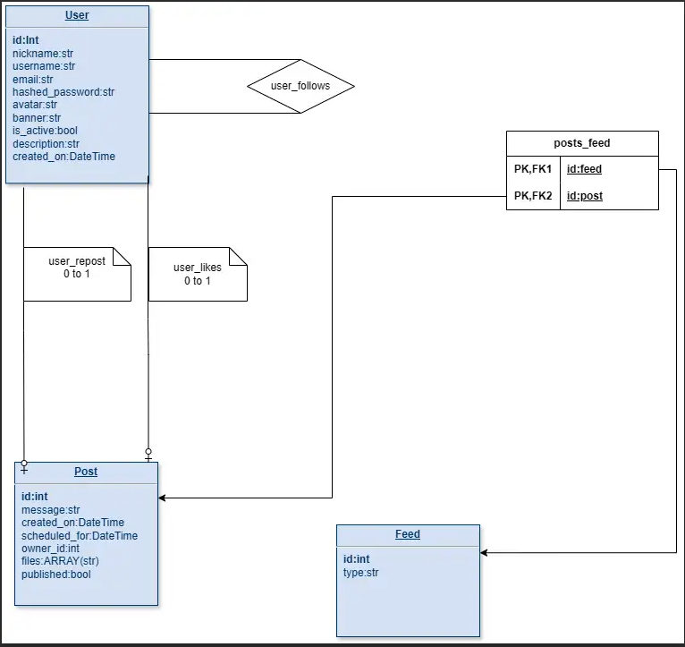
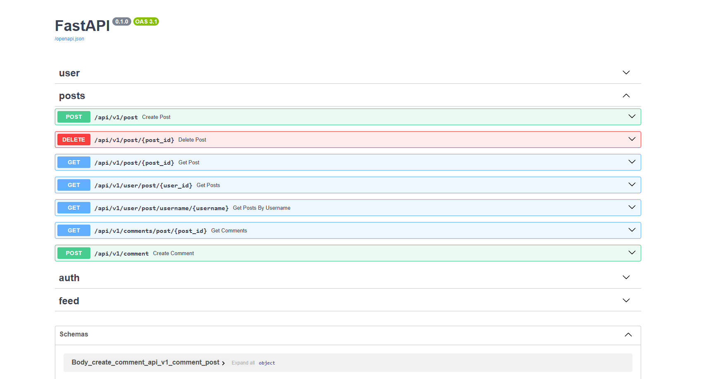

# Backend

This project is built with FastAPI and uses a PostgreSQL database.




## Installation

To install the necessary dependencies, run the following command in your terminal:

```bash
pip install -r requirements.txt
```

If u want fake users and fake posts to be created for you u can comment out create_fake_users() function in main.py and then run the main.py file once. **only if u want fake users to be created for u**

```bash
python main.py
```

After the installation is complete, you can start the application with:

```bash
uvicorn main:app --reload
```

Please ensure that you have a PostgreSQL server running and the connection details are correctly specified in your environment variables or configuration files.

## Database Setup

This project uses PostgreSQL as its database. Make sure to install PostgreSQL and create a database for this project. Update the database connection string in your environment variables or configuration files.

## FASTAPI

FastAPI is a modern, fast (high-performance), web framework for building APIs with Python 3.6+ based on standard Python type hints.

FastAPI has automatic interactive API documentation. If you run the project locally, you can go to http://localhost:8000/docs in your browser.
